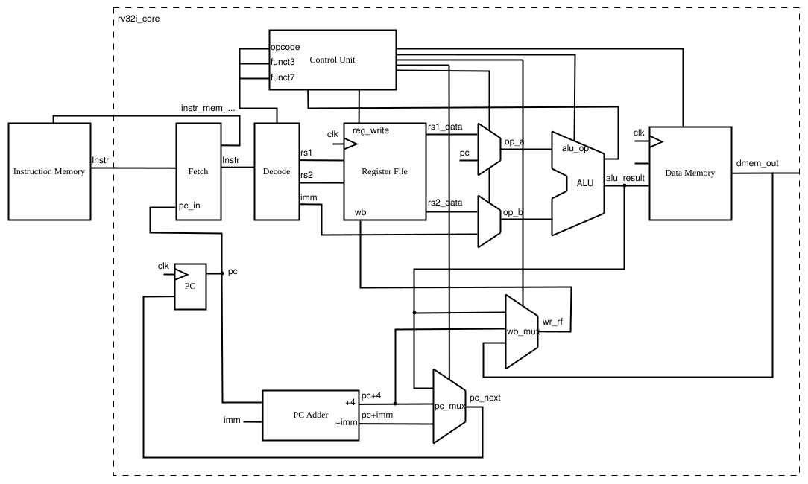

# RV32I RISC-V Single Cycle Processor
This repository is a light-weight, single-cycle RISC-V processor implementing the RV32I Base Integer Instruction Set. This project was developed primarily for educational purposes to explore and implement digital design, computer architecture, RTL development, and hardware synthesis.
## Overview
- **ISA**: RISC-V RV32I (Base Integer)
- **Language**: SystemVerilog
- **Execution Model**: Single-cycle ($CPI = 1$)
- **Architecture**: Harvard Architecture
- **Synthesis**: Synthesizable
- **System Clock**: 50 MHz
## Directory Structure
```
.
├── doc/                        # Documentation
├── rtl/                        # RTL Source Files
│   ├── rv32i_core.sv           # RV32I Top-level
│   └── ...
├── scripts/                    # Automation & Tool Flows.
├── syn/                        # Logic Synthesis Directory
│   └── constraints/            # Design Constraints
├── tb/                         # Testbench
│   ├── programs/               # Assembly & Hex binaries
│   ├── top.sv                  # Testbench top-level
│   └── ...
├── LICENSE
└── README.md
```
## RV32I Single-Cycle Processor

The processor implements a **Harvard Architecture** with dedicated buses for instruction and data memory. The diagram shows that the design follows the typical RISC-V stages pipeline (Fetch, Decode, Execute, Memory, Writeback). All operations are completed within a single clock period ($CPI = 1$).
### Design Methodology
- **Modular**: The core is partitioned into distinct functional units (ALU, Control Unit, Register File, etc) to ensure clean RTL and easier debugging.
- **Memory Interface**: The **Instruction Memory** acts as an external ROM initialized by the testbench, while **Data Memory** is integrated within the core for simplicity.
- **Synchronous Design**: All state elements (PC, RegFile, Data Memory) are rising-edge triggered; the Control Unit and ALU use combinational logic for immediate decoding.
- **Control and Datapath:**
	- The **Fetch** and **Decode** blocks can be combined but are separated to allow for a future transition to a pipelined execution model.
	- The **ALU**, aside from the `alu_result` output, provides `zero` and `comparison` flags to the **Control Unit** for branch/jump resolution.
	- The `PC+4` and `PC+imm` for updating PC and Branch/Jump operations are combined in the module **PC Adder**.
	- Final multiplexers (`wb_mux`, `pc_mux`) handle the write-back data and the next PC address.
### Supported Instructions
The implementation covers the essential RV32I base set (excluding `ecall`/`ebreak`):

| **Type**   | **Instructions**                                                             |
| ---------- | ---------------------------------------------------------------------------- |
| **R-Type** | `ADD`, `SUB`, `SLL`, `SLT`, `SLTU`, `XOR`, `SRL`, `SRA`, `OR`, `AND`         |
| **I-Type** | `ADDI`, `SLTI`, `SLTIU`, `XORI`, `ORI`, `ANDI`, `SLLI`, `SRLI`, `SRAI`, `LW` |
| **S-Type** | `SW`                                                                         |
| **B-Type** | `BEQ`, `BNE`, `BLT`, `BGE`, `BLTU`, `BGEU`                                   |
| **U-Type** | `LUI`, `AUIPC`                                                               |
| **J-Type** | `JAL`, `JALR`                                                                |

## Simulation
The testbench (`tb/top.sv`) instantiates the `rv32i_core` and an Instruction Memory model initialized with machine code is used as stimulus for the processor.
### Preparing Test Program
To test a custom program, it needs to convert RISC-V assembly into a hex file compatible with SystemVerilog `$readmemh`.
- A simple Python script is provided in `./scripts/risc_assemble_to_hexfile.py` to convert RISC-V assembly to SystemVerilog compatible hex format.
- **Note**: This script requires the **GNU RISC-V 32-bit Toolchain** to be installed in the system path.
- **Usage:** Change the `HEX_F` parameter in the testbench to point to desired hex file. The directory of assembly programs and hex files is located in `./tb/programs`
```
// Located in ./tb/top.sv
localparam string HEX_F = "all_instr_chain_test.hex"; // <Change hex file to load to instruction memory model>
```
### Running Simulator
Use your simulator of choice to compile and run the design. The file `./scripts/sourcecode.list` can be used to compile all necessary RTL files.
### Simulation Results
To test functionality of the core, the testbench is designed to trigger a console output whenever data is written to address `0x1000_0000` by the processor core. This mimics the behavior of a **UART transfer**.
#### 1. Instruction Chain Test (`all_instr_chain_test.S`)
- **Description:** A comprehensive sequence of R, I, S, B, U, and J-type instructions.
- **Expected Result:** A final write-back value of `0xdeadbeef`.

Console output:
```
--- Memory-mapped Output Table ---
Time (ps)  | InstrAddr  | Instr        | WriteData_dec    | WriteData_hex
----------------------------------------------------------------------------------------------
810000     | 0x000000b0 | 0x01f2a023   | 3735928559       | 0xdeadbeef  
Simulation complete via $finish(1) at time 10010 NS + 0

```
#### 2. Array Operation (`array_operation.S`)
- **Description:** Iterates through a memory array, multiplying each element by 2.
- **Input Array:** `[1, 2, 3, 4, 5]`
- **Expected Output:** `[2, 4, 6, 8, 10]`

Console output:
```
--- Memory-mapped Output Table ---
Time (ps)  | InstrAddr  | Instr        | WriteData_dec    | WriteData_hex
----------------------------------------------------------------------------------------------
1090000    | 0x0000003c | 0x00a62023   | 2                | 0x00000002  
1210000    | 0x0000003c | 0x00a62023   | 4                | 0x00000004  
1330000    | 0x0000003c | 0x00a62023   | 6                | 0x00000006  
1450000    | 0x0000003c | 0x00a62023   | 8                | 0x00000008  
1570000    | 0x0000003c | 0x00a62023   | 10               | 0x0000000a  
Simulation complete via $finish(1) at time 10010 NS + 0
```
#### 3. Fibonacci Sequence (`fibonacci_sequence.S`)
- **Description:** Calculates the 10th term of the Fibonacci sequence (starting at 1).
- **Expected Output:** `55` (Decimal)

Console output:
```
--- Memory-mapped Output Table ---
Time (ps)  | InstrAddr  | Instr        | WriteData_dec    | WriteData_hex
----------------------------------------------------------------------------------------------
1330000    | 0x00000028 | 0x0012a023   | 55               | 0x00000037  
Simulation complete via $finish(1) at time 10010 NS + 0
```
## Synthesis
The entire RTL design is fully synthesizable. A sample constraint file (SDC file) is provided in the `./syn/constraints` directory, defining a target clock frequency of 50 MHz.

The design was synthesized and analyzed using a Multi-Corner flow with the **NanGate 45nm Open Cell Library** (ASIC Flow). The implementation was evaluated across two extreme corners:
 
| Corner      | Timing Condition | Library Set | Voltage | Temperature |
| ----------- | ---------------- | ----------- | ------- | ----------- |
| Slow Corner | Max Delay        | slow_lib    | 0.95 V  | 125 °C      |
| Fast Corner | Min Delay        | fast_lib    | 1.25 V  | 0 °C        |

Report summary:

| Analysis View | TNS (ns) | Critical Path Slack (ns) | Cell Area (µm²) | Leaf Instance Count |
| ------------- | -------- | ------------------------ | --------------- | ------------------- |
| Slow Corner   | 0.0      | 2.1                      | 99229.704       | 58738               |
| Fast Corner   | 0.0      | 8365.4                   | 99229.704       | 58738               |

Both corners met the timing constraint in synthesis. The Fast Corner shows significant slack margin, whereas the Slow Corner slack is much tighter, and is likely not to meet timing during the Place and Route (PnR) stage. Due to the absence of a specific SRAM macro in the NanGate 45nm library, all memories and the registers were synthesized using flip-flops standard cell. The high instance count ($58,738$) and large cell area are direct results of this. In a production-grade flow, replacing these with dedicated **SRAM Macros** would drastically reduce area and improve timing slack.
## Future Development
- Transitioning to a 5-stage pipelined architecture to increase clock frequency and throughput.
- Implementing forwarding paths and hazard detection logic.
## License
This project is licensed under the MIT License. See the LICENSE file for details.
